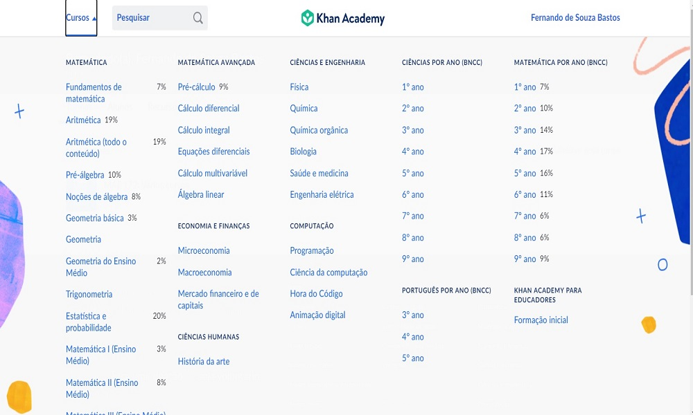
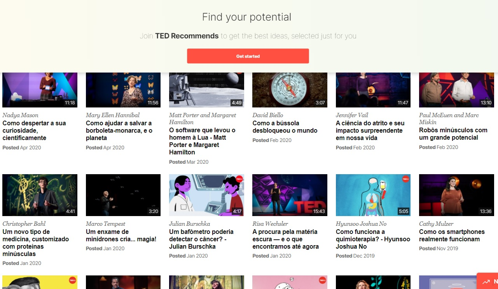
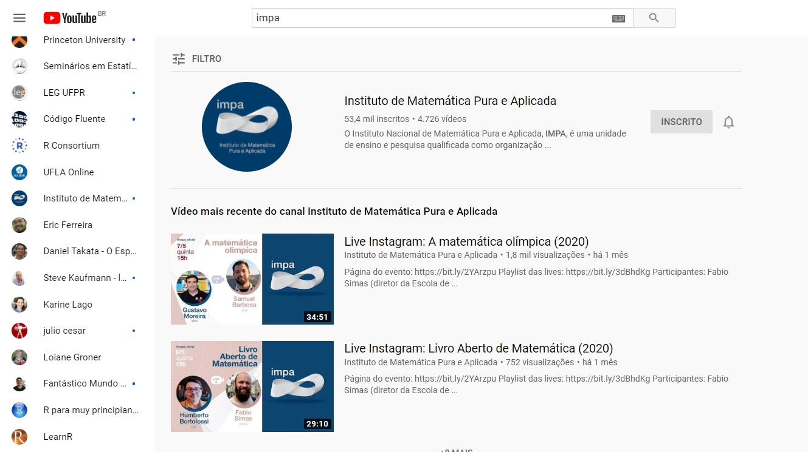

```{r, cache=FALSE, include=FALSE}
source("setup_knitr.R")
```

# Slides

.msmall[
- HTML: [Clique Aqui!](https://raw.githack.com/fsbmat-ufv/ColegioTiradentes/master/slides/ColTiradentes.html#1)
<!-- - PDF: endereco_aqui.pdf -->
- Código-fonte: [Clique Aqui!](https://github.com/fsbmat-ufv/ColegioTiradentes/tree/master/slides)
]

<table>
<tr><td><a href="https://tenor.com/view/gato-escribiendo-gif-6108221"></a></td>
</table>

```{r, echo=FALSE, out.width='50%'}
#knitr::include_graphics("../img/QrCode.png")
```


---
# Motivação

<table>
<tr><td></a></td>
</table>
<p style="text-align: center;">
A Matemática está em tudo e em todo lugar!
</p>

---

# Motivação

<table>
<tr><td></a></td>
</table>
<p style="text-align: center;">
A Estatística também!
</p>

---
<p style="text-align: justify;">
A afirmação "a matemática está em todo lugar" é um bom remédio para à pergunta clichê ''Quando ou onde vou usar isso?'' 
</p>
<p style="text-align: justify;">
A matemática está em toda parte, assim como tudo está em toda parte. A ciência está em toda parte, a arte está em toda parte, a linguagem está em toda parte e, em alguns casos, a onipresença é suficiente para convencer as pessoas de que usarão esses assuntos. Mas...
</p>
<p style="text-align: CENTER;">
NÃO É A MELHOR RESPOSTA!
</p>
---
<p style="text-align: justify;">
Precisamos, de fato, de motivação, não basta alguém nos dizer que é importante!
</p>

<p style="text-align: justify;">
No entanto, você jovem que faz essa pergunta para seu professor, já pensou que, seu professor não tem a resposta para tudo! E que a Matemática está presente em seu currículo pois em algum momento você irá precisar daquele assunto!
</p>
<table>
<tr><td></a></td>
</table>
---

<p style="text-align: justify;">
Você precisa ouvir!
</p>

<table>
<tr><td></a></td>
</table>

<p style="text-align: justify;">
Se você não quer estudar Matemática ou Estatística, você deve sair da Universidade! Se quiser terminar sua graduação, ou um mestrado, ou um doutorado, você terá que passar por alguma disciplina que usa conceitos matemáticos!
</p>
---

<p style="text-align: justify;">
De onde vem o pânico dos estudantes em relação a Matemática? É uma questão de personalidade, conhecimento prévio ou atitude? E como um estudante pode tirar boas notas?
</p>

<table>
<tr><td></a></td>
</table>

<p style="text-align: justify;">
Essas perguntas precisam ser respondidas pelo professor e pelo próprio estudante. Pois ambos precisam ser responsáveis pela formação acadêmica, pelo ensino e pelo aprendizado!
</p>
---

## Responsabilidades do Professor

<table class="center">
<tr><td><a href="https://www.amazon.com.br/Arte-Resolver-Problemas-G-Polya/dp/8571931364"></a></td>
<td>
<p style="text-align: justify;">
Um dos mais importantes deveres do professor é o de auxiliar os seus alunos, o que não é fácil, pois exige tempo, prática, dedicação e princípios firmes.
</p>

<p style="text-align: justify;">
Se o professor ajudar demais, nada restará para o aluno fazer. O professor deve auxiliar, nem de mais nem de menos, mas de tal modo que ao estudante caiba uma parcela razoável do trabalho.
</p>
</td>
</table>


<p style="text-align: justify;">
**Ser referência** - Há dois objectivos que o professor pode ter em vista ao dirigir ao seu aluno uma indagação ou um exercício: primeiro, auxiliá-lo a resolver o problema que lhe é apresentado; segundo, desenvolver no estudante a capacidade de resolver futuros problemas por si próprio.
</p>
---
class: center, middle, inverse
# O que é Necessário para o Estudante Aprender Matemática e Estatística?

---
<p style="text-align: justify;">
É suficiente...
</p>

<p style="text-align: justify;">
...assistir as aulas?
</p>

<p style="text-align: justify;">
...fazer as listas de exercícios?
</p>

<p style="text-align: justify;">
...assistir videos no youtube?
</p>

<p style="text-align: justify;">
...passar na disciplina, respondendo ou calculando os resultados sem interpretá-los?
</p>

<table>
<tr><td></a></td>
</table>
---
<table>
<tr><td></a></td>
</table>
---
<p style="text-align: justify;">
Matemática é um assunto que precisa de uma base sólida, pois depende de tópicos sequenciais. Por exemplo, você começa a somar, subtrair, dividir e multiplicar, a inserir incógnitas, equações, funções, depois a geometria básica, a trigonometria. Então, conforme você constrói seu conhecimento, você pode dominar assuntos mais difíceis em matemática, como álgebra, geometria e cálculo.
</p>
 
<p style="text-align: justify;">
Se você chegou a um curso superior, significa que você está apto a construir esse conhecimento. Mas precisa começar desde o inicio! Precisa estudar, principalmente, a matemática básica, o começo do cálculo e/ou da álgebra! Todos podem aprender matemática.
</p>
---
class: center, middle, inverse
# Mas, então, o que é Necessário para o Estudante Aprender Matemática e Estatística?

---

## Internalize as aulas de matemática

Resolver um problema de matemática sem o conhecimento prévio necessário seria como construir uma casa sem ter uma base sólida.

 - Se você tem dúvidas de Matemática Básica, estude conceitos básicos!

Para ser capaz de resolver um problema de matemática, primeiro você tem que entendê-lo e, para isso, uma visão abrangente do conteúdo abordado na aula é essencial.

 - Leia o material e o conteúdo da disciplina antes da aula, sempre que possível!

Tente entender o que o professor de matemática está dizendo. Se você não consegue entender algo, faça perguntas!

---

<p style="text-align: justify;">
- Refaça os exercícios apresentados em sala de aula!
</p>

<p style="text-align: justify;">
Para se tornar um bom aluno de matemática, refaça as contas do professor. Mesmo que você tenha tido a sensação de que entendeu o método de cálculo na aula, é algo completamente diferente fazer o cálculo sozinho. Assim, você irá compreender melhor o problema e, acima de tudo, poderá adaptar sua solução à do professor.
</p>

---

## Descubra os Horários em que Você é Mais Produtivo

Escolha o momento certo para estudar. Para alguns, é à noite, outros são mais produtivos pela manhã. Isso pode significar que você tem que estudar no fim de semana, mas se você trabalhar com muita concentração, poderá terminar mais rápido e terá tempo para outras coisas.
---

## Não se Esqueça do Ambiente de Estudos


Você deve encarar os estudos como um momento de trabalho, ou de dedicação de alguém que será um futuro profissional! Por isso, você precisa encontrar um local para se dedicar aos estudos! 

Algumas pessoas podem se distrair com música, enquanto outros podem se concentrar melhor. 

Na escrivaninha, na mesa da cozinha, ou no carpete? Ou talvez você tenha uma pequena varanda ou jardim? O ar fresco pode ajudar!

---

## Refaça os Exemplos do Livro Texto!

Principalmente, os exercícios que possuem aplicações práticas! Pratique, pratique, pratique! A prática leva à perfeição.

Muitas pessoas começam a aprender matemática por memorização. Embora essa tática em, alguns casos, possa funcionar, ela também pode causar problemas no futuro. 


---

## Defina Metas!

Depois de ler o material, ou assistir as aulas, você pode definir metas sobre quais os tipos de exercícios que deseja focar. Assim, você pode encontrar o caminho mais curto para aprender um determinado tópico.

---
## Estude seus erros! 


A maior vantagem da matemática é ser uma ciência exata. Para um determinado problema, só há uma solução! Portanto, você será capaz de analisar a sua solução para descobrir o erro de seu racíocinio, caso a sua resposta não esteja correta!


--- 

## Compreenda os Conceitos

Embora a matemática seja baseada em números e incógnitas, existem conceitos gerais para ajudar a entender os diferentes tipos de problemas matemáticos. Às vezes, tornamos a pergunta mais difícil do que realmente é, pois não entendemos o enunciado da pergunta. Certifique-se de ler as questões devagar e de entender a questão antes de começar a trabalhar na solução. A leitura correta e a interpretação fazem parte da solução da questão!
---

## Peça Ajuda Sempre que Necessário!

Muitas vezes, não conseguimos entender o que é preciso fazer para resolver uma questão e isso atrapalha a entender o conteúdo e/ou a matéria! Portanto, não tenha vergonha por ter que pedir ajuda!

---

# Momento em que Vivemos...

## *Evolução*
<p style="text-align: justify;">
O momento em que vivemos é uma mistura de gerações que está sofrendo para se adaptar a uma evolução precoce, mal formatada, não pensada e, de certa forma, imposta como realidade. Estamos adiantando, talvez cerca de 15 a 20 anos, no que diz respeito ao Ensino e Aprendizado com uso de tecnologias. De forma muito precária, pois esta evolução se deu ainda, apenas a partir do uso de tecnologias de interação online, tais como ZOOM, google meet ou outras ferramentas semelhantes. 
</p>
---
# Demoramos para perceber...

```{r, echo=FALSE,out.width="49%", out.height="20%",fig.cap=" ",fig.show='hold',fig.align='center'}
#knitr::include_graphics(c("../img/cell1.jpg","../img/cell2.jpg"))
``` 

<table>
<tr><td><a href="https://www.businessinsider.com/best-ways-to-transfer-data-to-new-phone-2018-12"></a></td>
    <td><a href="https://archive.shine.cn/business/Smartphone-growth-creating-etiquette-challenges/shdaily.shtml"></a></td>
</tr>
</table>

<p style="text-align: justify;">
De fato, não nos demos conta, mas a tecnologia, o uso de celular e de ferramentas tecnológicas já tomam conta da mente de nossos alunos, muito antes dessa pandemia.
</p>

---
<p style="text-align: justify;">
O fato é, que agora, ou os professores se adaptam a ferramentas de Ensino online, ou saem do mercado! E os alunos que antes poderiam ter dificuldades ou não aceitariam tão facilmente, já entenderam ou, acabarão entendendo, que é possível estudar online. Além disso, empresas que antes realizavam somente eventos presenciais, passarão a realizar também, ou somente eventos onlines daqui em diante, pois podem alcançar um público maior. Isso tudo, sem sair de casa, ou seja, sem perder tempo com deslocamentos.
</p>
---
<p style="text-align: justify;">
A pandemia não é bem vinda e ninguém deseja que ela permaneça, mas o fato é que ela adiantou alguns processos e fenômenos. Um deles, é a necessidade de profissionais que saibam trabalhar com o computador, o smartphone e outras ferramentas tecnológicas. Além disso, muitos processos serão automatizados daqui em diante, substituindo o trabalho humano. Não podemos fechar os olhos para essa verdade, ou nos adiantamos e nos aperfeiçoamos nos diversos recursos tecnológicos, ou estamos fadados ao desemprego e a dificuldades financeiras.
</p>
---

## Desafios

.msmall[
.pull-left-50[
**Professores:**

- Se manter jovem;
- Praticar o desapego e dar autonomia ao estudante;
- Se atualizar e sair da zona de conforto. Conversar mais com os pares;
- Utilizar metodologias ativas de Ensino;
- Elaborar avaliações.
]
.pull-right-50[
**Alunos:**

- Ter paciência;
- Ajudar o professor;
- Aprender a selecionar o que é importante!
]
]

---

class: center, middle, inverse
# Ensino Remoto

## Caixa de Ferramentas

---
```{r, echo=FALSE,out.width = "800px", out.height= "500px",fig.align='center'}
#
```

<table>
<tr><td><a href="https://pt.khanacademy.org/"></a></td>
</table>
<p style="text-align: justify;">
Khan Academy é uma organização sem fins lucrativos fundada por Salman Khan. No Brasil, os vídeos são traduzidos para português brasileiro pela Fundação Lemann.
</p>
---

<table>
<tr><td><a href="https://www.ted.com/"></a></td>
</table>
<p style="text-align: justify;">
O TED é uma organização sem fins lucrativos dedicada a espalhar idéias, geralmente na forma de palestras curtas (18 minutos ou menos). Existe desde 1984.
</p>
```{r, echo=FALSE,out.width = "800px", out.height= "500px",fig.align='center'}
#
```
---

<table>
<tr><td><a href="https://www.youtube.com/"></a></td>
</table>
<p style="text-align: justify;">
Plataforma de compartilhamento de vídeos com sede em San Bruno, Califórnia. O serviço foi criado por três ex-funcionários do PayPal - Chad Hurley, Steve Chen e Jawed Karim - em fevereiro de 2005. 
</p>
```{r, echo=FALSE,out.width = "800px", out.height= "500px",fig.align='center'}
#
```
---

# Outras indicações:

- [Veduca](http://veduca.org/)`r icon::fa("external-link-alt")`
- [Udemy](https://www.udemy.com/)`r icon::fa("external-link-alt")`
- [Data Science Academy](https://www.datascienceacademy.com.br/)`r icon::fa("external-link-alt")`
- [Code Avengers](https://www.codeavengers.com/)`r icon::fa("external-link-alt")`
- [Udacity](https://www.udacity.com/)`r icon::fa("external-link-alt")`
- [Coursera](https://www.coursera.org/)`r icon::fa("external-link-alt")`
- [Estatidados](https://linktr.ee/estatidados)`r icon::fa("external-link-alt")`
- [Financial Risk Academy](https://financial-risk-academy.teachable.com/courses/)`r icon::fa("external-link-alt")`
- Telegram e Whatsapp possuem canais de livros e de ajuda em disciplinas básicas!
- [Duolingo](https://www.duolingo.com/)`r icon::fa("external-link-alt")`
- [StackOverflow](https://pt.stackoverflow.com/)`r icon::fa("external-link-alt")`
- [StackExchange](https://stackexchange.com/sites)`r icon::fa("external-link-alt")`
- Se quiser saber mais sobre cursos online gratuitos [clique aqui](https://pt.lmgtfy.com/?q=cursos+online+gratuitos)
- Softwares R, Geogebra, Excel,  linguagem Latex - [(overleaf)](https://www.overleaf.com?r=4468ebc9&rm=d&rs=b)

---

<table>
<tr><td><a href="https://www.americatv.com.pe/noticias/salud/que-suenan-dedos-al-doblarlos-n265822"></a></td>
</table>


```{r, echo=FALSE,out.width = "900px", fig.align='center'}
#knitr::include_graphics("../img/beginWork.gif")
```

---


class: center, middle, inverse
# Ciência de Dados

---

## O que é...
<p style="text-align: justify;">
é a área que incluí informações e conceitos complexos sobre dados e análise de dados. É multidisciplinar e está estruturada em variados setores, canais e plataformas. Seu fluxo é dado por:
</p>
<table>
<tr><td><a href="https://openscapes.github.io/slides/betterscience/socalR#20">
</a></td>
</table>

---
<p style="text-align: justify;">
De acordo com o <a href="https://www.gartner.com/en/" title="Instituto Gartner">Instituto Gartner</a>, 2,2 milhões de terabytes de novos dados são criados todos os dias e a previsão é que até 2020 haja um total de 40 trilhões de gigabytes de dados no mundo.  Estima-se que menos de 5% dos dados gerados são analisados e transformados em informação.
</p>

<table>
<tr><td><a href="https://tenor.com/view/gato-escribiendo-gif-6108221"></a></td>
</table>

```{r, echo=FALSE,out.width = "600px", fig.align='center'}
#knitr::include_graphics("../img/Programacao.gif")
```

---

class: center, middle, inverse
#O que é preciso para se tornar um Cientista de Dados?

---

## Ter um pensamento lógico-matemático

<table>
<tr><td><a href="https://tenor.com/view/imlost-im-lost-confused-calculate-gif-9919713"></a></td>
</table>

Estude geometria, álgebra, contagem, funções, probabilidade, matemática financeira e etc.

---

## Aprenda a programar

<table>
<tr><td><a href="https://tenor.com/view/programing-crazy-hard-developer-gif-7866345"></a></td>
</table>

<p style="text-align: justify;">
É extremamente importante saber programar em alguma linguagem. Dê preferência a linguagens de programação consolidadas, C, C++, java, python, R e ou qualquer outra que seja de interesse do mercado. Além disso, saiba trabalhar com banco de dados, no minímo, em formatos exportados pelo Excel, xls, xlsx, csv e txt. 
</p>

---

## Gostar de estudar

<table>
<tr><td><a href="https://tenor.com/view/book-studying-study-getting-knowledge-funny-gif-17502795"></a></td>
</table>

<p style="text-align: justify;">
Ser pró-ativo e saber buscar a informação de maneira rapída depende de estudo constante e muita leitura.
</p>
---

## Salário

<table>
<tr><td><a href="https://www.vagas.com.br/cargo/cientista-de-dados"></a></td>
</tr>
</table>

[Vagas.com](https://www.vagas.com.br/cargo/cientista-de-dados)

[Exame](https://exame.com/carreira/as-linguagens-de-programacao-com-os-maiores-salarios-do-mundo-em-2020/) - Salário médio anual no mundo para quem trabalha com o software R e a linguagem R é de US$ 61.629,60.

---


class: center, middle, inverse
# Software R

---
<p style="text-align: justify;">
Após instalar o software R e abrir o programa veremos algo semelhante a:
</p>

<table>
<tr><td><center></center></td>
</tr>
</table>

```{r, echo=FALSE,out.width = "1000px", fig.align='center'}
#knitr::include_graphics("../img/Console_R.jpg")
```

---

<p style="text-align: justify;">
Apesar de ser simples utilizar o R diretamente do seu console raiz, existe um compilador que é mais atrativo. O RStudio é o melhor ambiente disponível para programação em R. Ao abrir o RStudio, você verá 4 ambientes. Observe a figura abaixo.
</p>

<table>
<tr><td><center></center></td>
</tr>
</table>

```{r, echo=FALSE,out.width = "500px", fig.align='center'}
#knitr::include_graphics("../img/rstudio-editor.png")
```
---

<table>
<tr><td><a href="https://fsbmat-ufv.github.io/"></a></td>
    <td><a href="https://maf172.github.io/"></a></td>
</tr>
</table>
<table>
<tr><td><a href="https://maf105.github.io"></a></td>
    <td><a href="https://maf261.github.io"></a></td>
</tr>
</table>

---
<table>
<tr><td><a href="https://arxiv.org/abs/2004.11470"></a></td>
    <td><a href="https://www.tandfonline.com/doi/abs/10.1080/02664763.2020.1780570?journalCode=cjas20"></a></td>
</tr>
</table>
<table>
<tr><td><a href="https://fsbmat-ufv.shinyapps.io/orcDesp/"></a></td>
    <td><a href="https://fsbmat-ufv.shinyapps.io/flexdashboard/"></a></td>
</tr>
</table>
---


> *Ciência é conhecimento que entendemos tão bem que podemos ensiná-la
> para um computador. Todo o resto é arte.*

> Donald Knuth, 1974

---

# Referências

- Bastos, F.S. [Dashboard sobre a Covid19](https://fsbmat.shinyapps.io/CoronaBR/), acessado em 29/06/2020.
- Pesquisadores, Professores e Alunos da UFMG. [CovidLP - Previsão de Curto e Longo prazos para Covid-19](http://est.ufmg.br/covidlp/home/pt/), acessado em 29/06/2020. 
- Pesquisadores, Professores e Alunos de diversas Instituições de Ensino [Observatório Covid-19 BR](https://covid19br.github.io/index.html), acessado em 29/06/2020.
- Melo, C., [SIGMODAL](https://sigmoidal.ai/quanto-ganha-um-cientista-de-dados/), acessado em 29/06/2020.

---

class: center, middle, inverse
# Obrigado!

